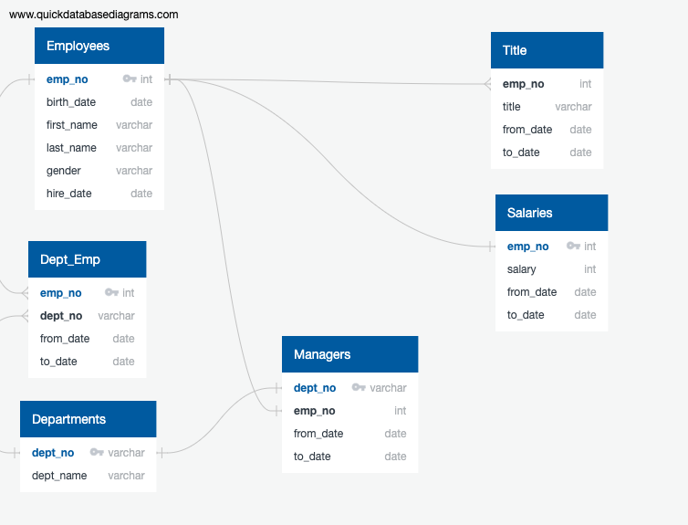

# Pewlett-Hackard-Analysis

## Overview:
   The goal of this project is to help Pewlett Hackard figure out the near future human resources need. Pewlett Hackard was in the Industry for a long time and they have a lot of long time employees. So in order for them to successfully run the business, they have to figure out how many employees might be needed and also plan for existing employees who might be retiring.

## Analysis:

### Step 1:
   To satisfy the current need for Pewlett Hackard the current legacy system of CSV and VBA may not be a good option. As a first step, we will migrate the data from the CSV file into a SQL Database. Having understood their CSV data we have a schema design that would better represent the data in the SQL world 
   
### Step 2:
   Find the employees who are either retired or might be retiring based on age and hiring date. In Pewlett Hackward case we would classify any employee who is age 65 to 68 and with the company for 32 to 35 would be considered as employees who might be either retired or retiring soon. Knowing the data on how many employees fall under this category would help them to plan. Using a simple query and creating a table would help us to further drill down on these employees
    
   SELECT emp_no, first_name, last_name 
   INTO retirement_info 
   FROM employees where 
   (birth_date BETWEEN '1952-01-01' AND '1955-12-31') AND
   (hire_date BETWEEN '1985-01-01' AND '1988-12-31');
   
   Though the above SQL gives the data we need, we might be having some of the employees still working in Pewlett Hackard. So narrowing down on current employees by depart would help them to plan much better based on skillset and experience needed. In order to get the data from the SQL, we have to join two different tables. Joining retirement_info table and dept_emp we should be able to get data with an additional filter on to_date we would get current employees. LEFT JOIN would help us to keep all the data from retirement_info and augmenting with department information from dept_emp table.
   
   SELECT ri.emp_no,
   ri.first_name,
   ri.last_name,
   de.to_date
   INTO current_emp
   FROM retirement_info as ri
   LEFT JOIN dept_emp as de
   ON ri.emp_no = de.emp_no
   WHERE de.to_date = ('9999-01-01');
   
   Employee information along with salary would help us to financially plan both for retirement and to hire the resource. LEFT JOIN with salaries table would get that information for getting depart information we would find the intersection of the data using INNER JOIN. The below query would help you to get employees who are either retired or on the verge of retirement along with department and their salary.
   
   SELECT e.emp_no, 
   e.first_name, 
   e.last_name,
   e.gender,
   s.salary,
   de.dept_no
   INTO emp_info
   FROM employees as e
   LEFT JOIN salaries as s
   ON e.emp_no = s.emp_no
   INNER JOIN dept_emp as de
   ON e.emp_no = de.emp_no
   where (e.birth_date BETWEEN '1952-01-01' AND '1955-12-31') 
   AND (e.hire_date BETWEEN '1985-01-01' AND '1988-12-31')
   AND de.to_date = ('9999-01-01');
   
   Like it is critical to plan Employee retirement we also need to plan for Managers retirement. Since we have the current employees data into current_emp find the managers would be easy by joining the current employees with dep_manager table to find the detail we need. INNER JOIN both departments and current_emp with dept_manager would get the details we need.
   
   SELECT dm.dept_no,
   d.dept_name,
   dm.emp_no,
   ce.first_name,
   ce.last_name,
   dm.from_date,
   dm.to_date
   INTO manager_info
   FROM dept_manager as dm
   INNER JOIN departments as d
   ON dm.dept_no = d.dept_no
   INNER JOIN current_emp as ce
   ON dm.emp_no = ce.emp_no;

